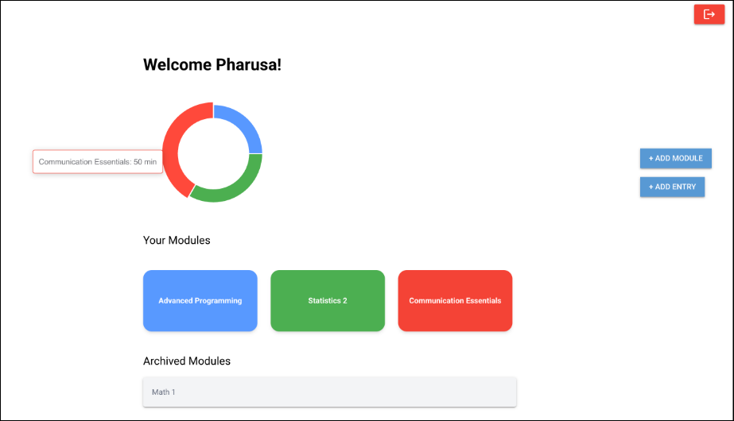
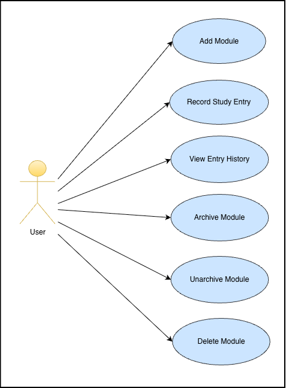
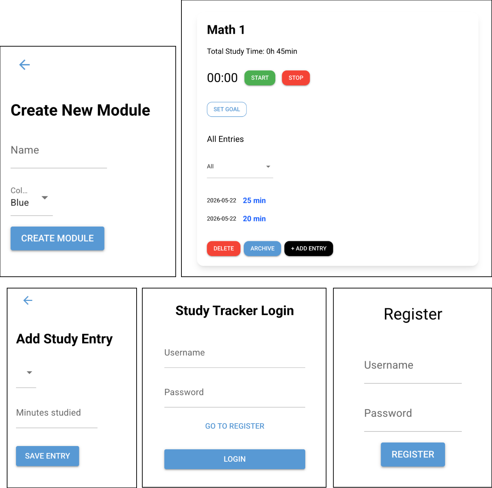
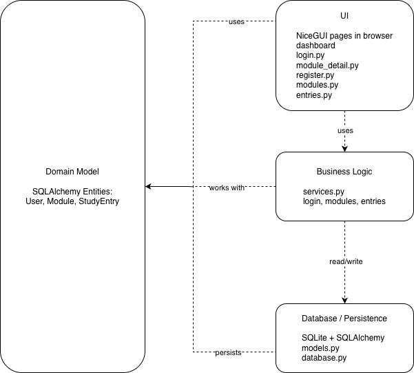
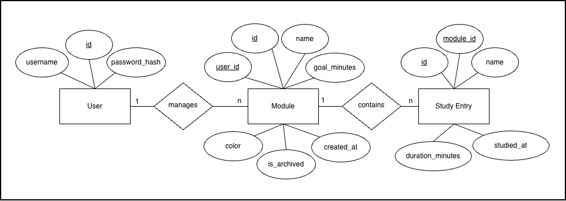

# Study-Time-Tracker



## Project Description

**StudyTimeTracker** is a browser-based web app that helps students track study entries, organize by module, and monitor progress toward learning goals. Record time spent, review history, and build better study habits—all from your browser.

## Application Requirements

### Problem

Students often lose track of how much time they spend studying, especially when they work on multiple modules or switch between study entries. Without a structured system, study time can be forgotten, miscounted, or not connected to the right module.

### Scenario

The application allows users to:

- register and log in to their account
- create and manage modules
- record study entries for each module
- store study data in a database
- view past study history
- track how much time has been spent on each module
- set study goals per module

## Features

- **Track Study Entries**: Start/stop timer or manual entry for precise logging
- **Database persistence**: Store all entries reliably with module organization
- **Study history**: Browse past entries, filter by date
- **Time analytics**: Calculate total minutes per module
- **Archive module**: Hide completed courses from active view while preserving data
- **Set Goals**: Set goals for each module and track their progression

## User Stories

### 1. Track Study Time
**As a student, I want to track my study time so that I can improve my productivity.**

- **Inputs:** Start/stop buttons
- **Outputs:** Live timer display, entry duration saved to database

### 2. Save Study Entries
**As a student, I want to save my study entries so that I do not lose my data.**

- **Inputs:** Entry details (module, duration, date/time auto-captured)
- **Outputs:** Confirmation message, data persisted in database

### 3. View Study History
**As a student, I want to view my study history so that I can analyze my study habits.**

- **Inputs:**  Module filters
- **Outputs:** Table/list of past entries with duration, module, date

### 4. Organize Study Entries
**As a student, I want to organize my entries by module so that I know what I study most.**

- **Inputs:** Module selector when creating entries, edit module option
- **Outputs:** Study entries grouped by module, total time per module displayed

### 5. Archive Modules
**As a student, I want to archive old modules so I can organize my trackings.**

- **Inputs:** Archive button
- **Outputs:** Module moves to archived list, excluded from active dashboard

### 6. Unarchive Modules
**As a student, I want to unarchive old modules so that I can make them active again when I need them.**

- **Inputs:** Unarchive button inside archived module
- **Outputs:** Module is restored to the active module list and included again in statistics

### 7. Delete Modules
**As a student, I want to delete modules from the list of modules**

- **Inputs:** Delete button
- **Outputs:** Module deleted

### 8. Track Goals
**As a student, I want to set goals for my study time and track my progress towards it.**

- **Inputs** Amount of time in hours
- **Outputs:** Goal set and tracked

## Use Cases



### Primary Actor
**Student User**

### Participating Actor
**System**

Use Case 1: Add Module<br>
Use Case 2: Record Study Entry<br>
Use Case 3: View Entry History<br>
Use Case 4: Archive Module<br>
Use Case 5: Unarchive Module<br>
Use Case 6: Delete Module

### Wireframes / Mockups



## Architecture



### Layers
- **UI:** NiceGUI pages in the browser
- **Logic:** services for login, modules, and study entries
- **Database:** SQLite with SQLAlchemy

### Design Decisions
- MVC-style structure
- Clear separation between pages, logic, and database
- Business logic stays outside the UI
- Object-oriented service architecture using dedicated service classes
- Encapsulation of business logic through UserService, ModuleService, and StudyEntryService

### Design Patterns Used
- **Model-View-Controller:** the app is split into pages, services, and models so each part has one job.
- **Facade Pattern:** `init_db.py` hides the database setup details and keeps startup simple.

## Database and ORM



The application uses **SQLAlchemy ORM** to map domain objects to a SQLite database.

### Entities
- `User` 
- `Module` 
- `StudyEntry`

### Relationships
- One `User` → many `Module`
- One `Module` → many `StudyEntry`
- Each `StudyEntry` references one `Module`

## Project Requirements

This project was built to satisfy the core course requirements: a browser-based app, input validation, and database management through an ORM.

### 1. NiceGUI Web Application

The app runs in the browser and provides an interactive interface for the user. In StudyTimeTracker, users can log in, register, create modules, and record study entries without leaving the web app. Navigation happens between NiceGUI pages, so the whole experience stays inside the browser.

### 2. Input Validation

The application checks user input before saving data. For example, registration fields cannot be empty, module names must be provided, and study entry durations must be valid numbers. These checks help avoid errors and keep the stored data consistent.

### 3. Database Management with an ORM

All persistent data is handled through SQLAlchemy with a SQLite database. The project stores users, modules, and study entries as connected entities. The relationships between them allow the app to link study records to the correct module and user while keeping the data organized.

## Implementation

### Technology

- Python 3
- NiceGUI 
- SQLAlchemy
- SQLite
- Pytest

### Libraries Used

- **nicegui** – used to build the login, registration, module, and study entry pages
- **sqlalchemy** – used to define ORM models and manage database relationships
- **sqlite3** – stores the application data locally in a SQLite database file
- **datetime** – used for timestamps and study entry dates
- **hashlib** – used to hash user passwords before saving them
- **pytest** – used for testing database and service-layer behavior 

## Repository Structure

```text
Study-Time-Tracker/
├── README.md
└── app/
    ├── database.py
    ├── init_db.py
    ├── main.py
    ├── models.py
    ├── services.py
    └── pages/
        ├── dashboard.py
        ├── entries.py
        ├── login.py
        ├── modules.py
        ├── module_detail.py
        └── register.py
└── docs/
    └── ER_diagram.png
    └── UI_showcase.png
    └── UML_class_diagram.png
    └── use_cases.png
    └── wireframe_mockups.png
└── test/
    ├── conftest.py
    ├── test_database.py
    ├── test_integration.py
    └── test_services.py
└── requirements.txt

```

### File Overview
- `README.md` – Project documentation and setup instructions.
- `app/main.py` – Application entry point; initializes the database, imports the page modules, and starts the NiceGUI server.
- `app/database.py` – Configures the SQLite engine, SQLAlchemy session factory, and base class for ORM models.
- `app/init_db.py` – Creates database tables and inserts initial demo data such as a sample user, module, and study entry.
- `app/models.py` – Defines the ORM entities `User`, `Module`, and `StudyEntry`, including their relationships.
- `app/services.py` – Contains the application logic used by the UI pages, such as creating users, modules, and entries, and retrieving study data.
- `app/pages/` – Contains the browser-based UI pages built with NiceGUI.
- `app/pages/login.py` – Login page for existing users.
- `app/pages/register.py` – Registration page for new users.
- `app/pages/modules.py` – Page for creating and managing modules.
- `app/pages/entries.py` – Page for recording and viewing study entries.
- `app/pages/module_detail.py` – Page for entry histories, goals and timers.
- `app/pages/dashboard.py` - Page for dashboard, overview of all modules and ring diagram.
- `app/pages/dashboard.py` - Page for dashboard, overview of all modules and ring diagram.
- `tests/conftest.py` – Shared pytest configuration and reusable test fixtures.
- `tests/test_database.py` - Test cases for database.
- `tests/test_intergation.py` - Integration tests.
- `tests/test_services.py` - Unit tests.

## How to Run

### 1. Clone the repository

```bash
git clone https://github.com/PharusaRajendran/Study-Time-Tracker
```

```bash
cd Study-Time-Tracker
```

### 2. Install the dependencies

```bash
pip install -r requirements.txt
```

or

```bash
pip3 install -r requirements.txt
```

### 3. Start the application

```bash
python3 -m app.main
```

or

```bash
python -m app.main
```

### 4. Open the app in your browser

After the server starts, open the local URL shown in the terminal, usually:

```bash
http://localhost:8080
```

## Testing

### How to Run Tests

```bash
python -m pytest
```

or

```bash
python3 -m pytest
```

---

| Field                       | Details                                                                            |
| --------------------------- | ---------------------------------------------------------------------------------- |
| Test case ID                | TC_001                                                                             |
| Test case title/description | Verify that a module can be created with a valid user ID, name, and color          |
| Preconditions               | - User exists<br>- System/database is accessible                                       |
| Test steps                  | 1. Call create_module(user_id, "Maths", "#5898ff")<br>2. Capture returned module |
| Test data/input             | User ID: 1<br>Name: Maths<br>Color: #5898ff                                          |
| Expected result             | Module is created successfully with the given values. test_services.py             |
| Actual result               | Module is created successfully with the given values. test_services.py             |
| Status                      | Pass                                                                               |
| Comments                    | No issues found                                                                    |


| Field                       | Details                                                                                              |
| --------------------------- | ---------------------------------------------------------------------------------------------------- |
| Test case ID                | TC_002                                                                                               |
| Test case title/description | Verify that a study entry can be created for an existing module                                      |
| Preconditions               | - Module exists<br>- System/database is accessible                                                       |
| Test steps                  | 1. Create a module<br>2. Call create_entry(module.id, 60)<br>3. Retrieve entries with get_entries(module.id) |
| Test data/input             | Duration minutes: 60                                                                                 |
| Expected result             | One entry is created and its duration is 60. test_services.py                                        |
| Actual result               | One entry is created and its duration is 60. test_services.py                                        |
| Status                      | Pass                                                                                                 |
| Comments                    | No issues found                                                                                      |


| Field                       | Details                                                                                                                                 |
| --------------------------- | --------------------------------------------------------------------------------------------------------------------------------------- |
| Test case ID                | TC_003                                                                                                                                  |
| Test case title/description | Verify that all entries for a module are returned correctly                                                                             |
| Preconditions               | - Module exists<br>- At least two entries can be created                                                                                    |
| Test steps                  | 1. Create a module<br>2. Call create_entry(module.id, 30)<br>3. Call create_entry(module.id, 45)<br>4. Retrieve entries with get_entries(module.id) |
| Test data/input             | Entry durations: 30, 45                                                                                                                 |
| Expected result             | Two entries are returned. test_services.py                                                                                              |
| Actual result               | Two entries are returned. test_services.py                                                                                              |
| Status                      | Pass                                                                                                                                    |
| Comments                    | No issues found                                                                                                                         |


| Field                       | Details                                                                    |
| --------------------------- | -------------------------------------------------------------------------- |
| Test case ID                | TC_004                                                                     |
| Test case title/description | Verify that a module can be archived successfully                          |
| Preconditions               | - Module exists<br>- System/database is accessible                             |
| Test steps                  | 1. Create a module<br>2. Call archive_module(module.id)<br>3. Check archived state |
| Test data/input             | Module name: Maths                                           |
| Expected result             | Module is marked as archived. test_services.py                             |
| Actual result               | Module is marked as archived. test_services.py                             |
| Status                      | Pass                                                                       |
| Comments                    | No issues found                                                            |


| Field                       | Details                                                                                                       |
| --------------------------- | ------------------------------------------------------------------------------------------------------------- |
| Test case ID                | TC_005                                                                                                        |
| Test case title/description | Verify that a module can be deleted and no longer appears in active modules                                   |
| Preconditions               | - Module exists<br>- User has active modules                                                                      |
| Test steps                  | 1. Create a module<br>2. Call delete_module(module.id)<br>3. Retrieve active modules with get_active_modules(user_id) |
| Test data/input             | User ID: 888<br>Module name: Maths                                                                   |
| Expected result             | Module is deleted successfully and is not returned in active modules. test_services.py                        |
| Actual result               | Module is deleted successfully and is not returned in active modules. test_services.py                        |
| Status                      | Pass                                                                                                          |
| Comments                    | No issues found                                                                                               |


| Field                       | Details                                                                  |
| --------------------------- | ------------------------------------------------------------------------ |
| Test case ID                | TC_006                                                                   |
| Test case title/description | Verify that creating an entry with an invalid module raises an exception |
| Preconditions               | - Application is running                                                 |
| Test steps                  | 1. Call create_entry(None, 60)<br>2. Observe behavior                        |
| Test data/input             | Module ID: None<br>Duration minutes: 60                                      |
| Expected result             | An exception is raised. test_services.py                                 |
| Actual result               | An exception is raised. test_services.py                                 |
| Status                      | Pass                                                                     |
| Comments                    | No issues found                                                          |


| Field                       | Details                                                                                |
| --------------------------- | -------------------------------------------------------------------------------------- |
| Test case ID                | TC_007                                                                                 |
| Test case title/description | Verify that a user record is saved correctly in the database                           |
| Preconditions               | - Database session is available                                                        |
| Test steps                  | 1. Create a User object<br>2. Add and commit it to the session<br>3. Query the user back by ID |
| Test data/input             | Username: db_test_user_<uuid><br>Password hash: test_password                              |
| Expected result             | Saved user exists and username matches the inserted value. test_database.py            |
| Actual result               | Saved user exists and username matches the inserted value. test_database.py            |
| Status                      | Pass                                                                                   |
| Comments                    | No issues found                                                                        |


| Field                       | Details                                                                                      |
| --------------------------- | -------------------------------------------------------------------------------------------- |
| Test case ID                | TC_008                                                                                       |
| Test case title/description | Verify that a module record is saved correctly in the database                               |
| Preconditions               | - Database session is available                                                              |
| Test steps                  | 1. Create a Module object<br>2. Add and commit it to the session<br>3. Query the module back by name |
| Test data/input             | User ID: 1<br>Name: Maths<br>Color: #5898ff                                                 |
| Expected result             | Saved module exists and its fields match the inserted values. test_database.py               |
| Actual result               | Saved module exists and its fields match the inserted values. test_database.py               |
| Status                      | Pass                                                                                         |
| Comments                    | No issues found                                                                              |


| Field                       | Details                                                                                       |
| --------------------------- | --------------------------------------------------------------------------------------------- |
| Test case ID                | TC_009                                                                                        |
| Test case title/description | Verify that a study entry record is saved correctly in the database                           |
| Preconditions               | - Database session is available                                                               |
| Test steps                  | 1. Create a StudyEntry object<br>2. Add and commit it to the session<br>3. Query the entry back by ID |
| Test data/input             | Module ID: 1<br>Duration minutes: 25                                                              |
| Expected result             | Saved study entry exists and duration matches the inserted value. test_database.py            |
| Actual result               | Saved study entry exists and duration matches the inserted value. test_database.py            |
| Status                      | Pass                                                                                          |
| Comments                    | No issues found                                                                               |


| Field                       | Details                                                                                         |
| --------------------------- | ----------------------------------------------------------------------------------------------- |
| Test case ID                | TC_010                                                                                          |
| Test case title/description | Verify that a module can be created and a study entry can be added to it in an integration flow |
| Preconditions               | - Service layer is available                                                                    |
| Test steps                  | 1. Create a module<br>2. Add an entry to that module<br>3. Retrieve entries for the module              |
| Test data/input             | User ID: 1<br>Name: Maths<br>Color: #5898ff<br>Entry duration: 45                              |
| Expected result             | One entry is returned with duration 45. test_integration.py                                     |
| Actual result               | One entry is returned with duration 45. test_integration.py                                     |
| Status                      | Pass                                                                                            |
| Comments                    | No issues found                                                                                 |


| Field                       | Details                                                                                   |
| --------------------------- | ----------------------------------------------------------------------------------------- |
| Test case ID                | TC_011                                                                                    |
| Test case title/description | Verify that multiple entries update the total minutes correctly                           |
| Preconditions               | - Service layer is available                                                              |
| Test steps                  | 1. Create a module<br>2. Add two entries with different durations<br>3. Call get_total_minutes(1) |
| Test data/input             | User ID: 1<br>Name: Maths<br>Durations: 20, 40                                 |
| Expected result             | Total minutes are at least 60. test_integration.py                                        |
| Actual result               | Total minutes are at least 60. test_integration.py                                        |
| Status                      | Pass                                                                                      |
| Comments                    | No issues found                                                                           |


| Field                       | Details                                                                                                          |
| --------------------------- | ---------------------------------------------------------------------------------------------------------------- |
| Test case ID                | TC_012                                                                                                           |
| Test case title/description | Verify that an archived module is removed from the active modules list                                           |
| Preconditions               | - Service layer is available                                                                                     |
| Test steps                  | 1. Create a module<br>2. Archive the module<br>3. Retrieve active modules<br>4. Check that archived module ID is not present |
| Test data/input             | User ID: 1<br>Name: Maths<br>Color: #F44336                                                         |
| Expected result             | Archived module does not appear in active modules. test_integration.py                                           |
| Actual result               | Archived module does not appear in active modules. test_integration.py                                           |

## Work Distribution

| Team Member | Responsibilities |
|-------------|------------------|
| **Alex** | README file<br>user service logic<br>module service logic<br>organisation and protocolling<br>test cases |
| **Roda** | entries service logic<br>modules UI<br>entries UI<br>tests<br>README file foundation<br> |
| **Pharusa** | lead role<br>database<br>login UI<br>register UI<br>dashboard UI<br>module detail UI<br>first mockups |

## License

This project was created for educational purposes as part of the Advanced Programming module in the second semester of the Bachelor of Business IT at the University of Applied Sciences Northwestern Switzerland, School of Business.